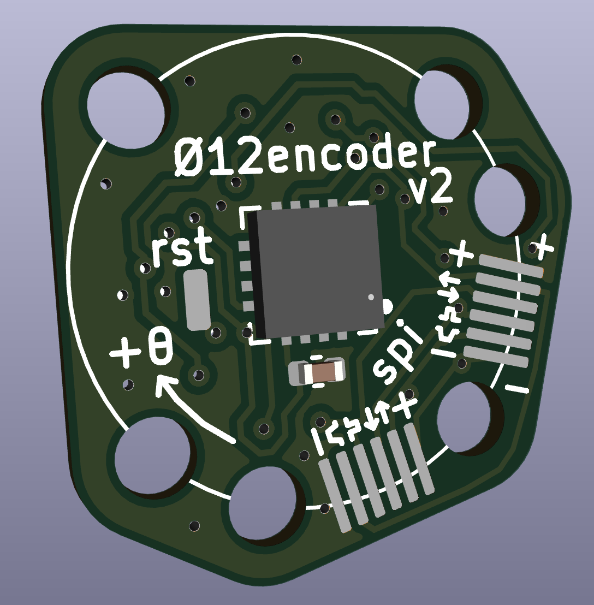

## Compact magnetic encoder on RS485 bus

Intended to work with [squirrelbrain](https://github.com/qwertpas/squirrelbrain) as part of the [Pintobotics](https://pintobotics.substack.com) project.

Magnetic sensor: [MA702](https://www.monolithicpower.com/en/ma702.html)

MCU: [STM32L011F4U](https://www.digikey.com/en/products/detail/stmicroelectronics/STM32L011F4U6TR/6166960)

Size: 14.04mm x 14.04mm

Mounting: 6x M2 on 12mm diameter circle, four distributed on square and three distributed on an equilateral triangle (for certain small drone motors)

Connection: 2x 4pin 0.5mm pitch FFC for power and RS485 communication (daisy chainable)

Alternate connection: 2x SPI solder pads, aux GPIO/ADC

